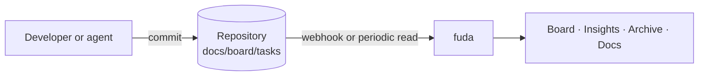

# What fuda is

fuda is a read-only board over a git repository. Each task is a markdown file in
`docs/board/tasks/`, and its frontmatter (`status`, `owner`, `labels`, …) is its state. fuda reads
those files from GitHub, Azure DevOps or a local checkout and shows them as a board, an insights
view, an archive and a reader for the repository's docs.

fuda never writes to the repository. People, and their AI agents, move tasks with ordinary
commits. The board follows within seconds when a webhook is set up, and within a few minutes
otherwise.

## Where to go next

| You want to | Read |
|---|---|
| Put a repository on fuda | [Set up a repo](/guide/setup-a-repo) |
| Write or change tasks | [Task format](/guide/task-format) and [Workflow](/guide/workflow) |
| Control columns, label filters and people | [Board config files](/guide/board-config) |
| Let your AI agent keep the board right | [Agent guide](/guide/agent-guide) |
| Try fuda on your machine | [Run locally](/guide/run-locally) |
| Host it for a team | [Self-host](/guide/self-host) |

## How the board decides things

- **Columns** come from `docs/board/stages.md`, or from the statuses found in the tasks. A status
  that no column lists gets its own column, marked unknown, so nothing is ever hidden.
- **In review** is the one derived column: a task that an open pull request delivers, meaning the
  PR sets it to `merged` or adds its number to `pr`.
- **In prod** appears when fuda also watches `main` and the task's file there is merged, testing
  or validated.
- **Problems** lists files fuda could not read. They are left off the board and the rest still
  works.
