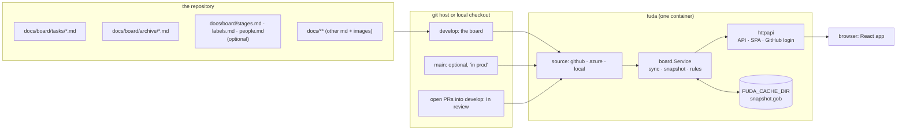
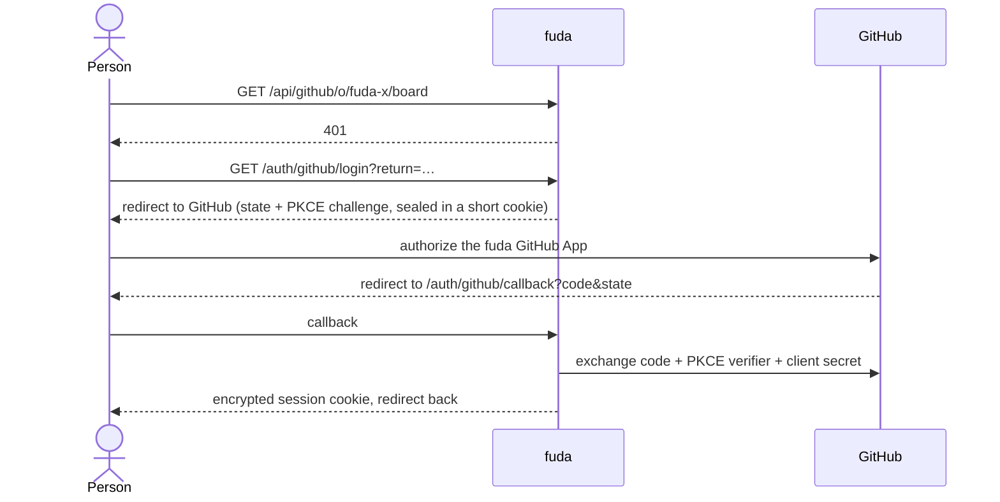
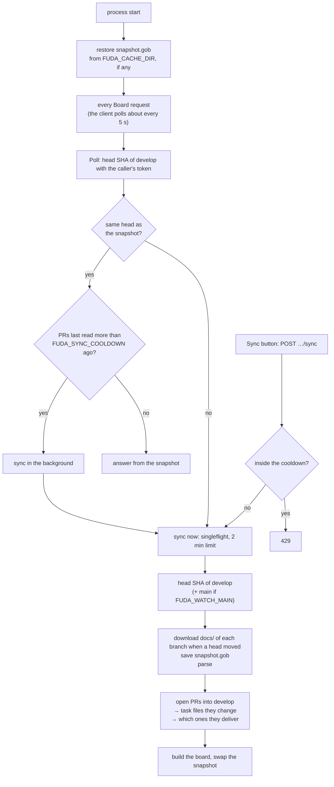
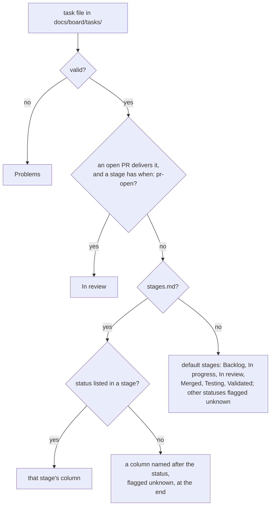
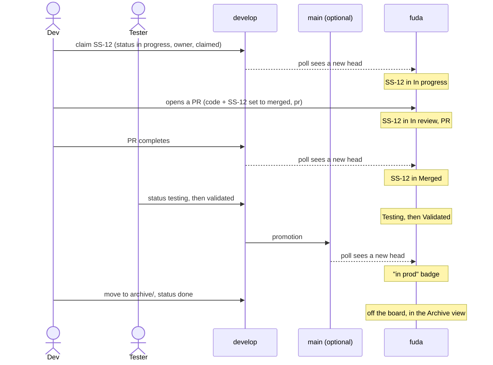
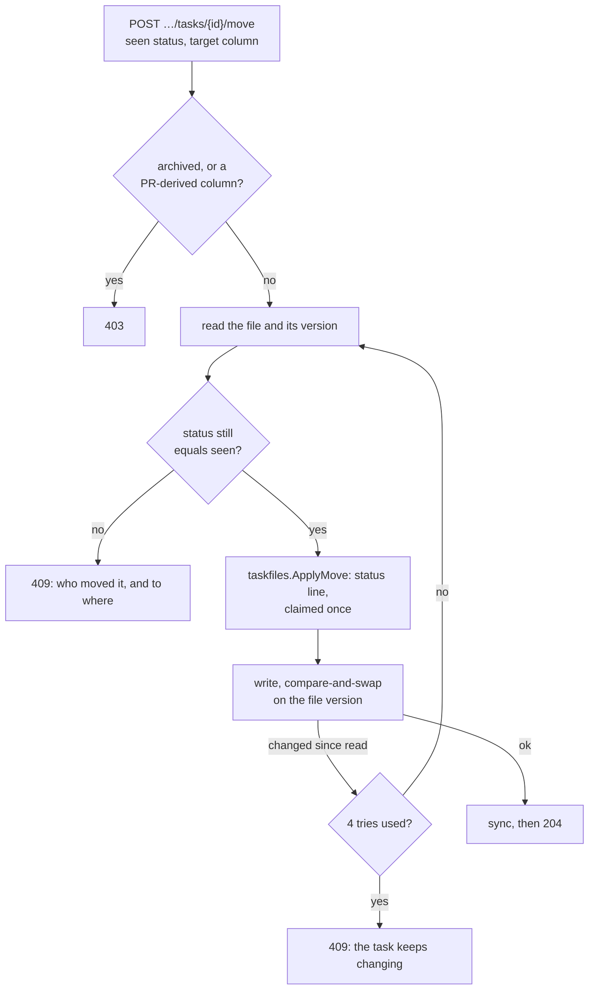

# Architecture

How fuda works today. Everything here is true of the code on `main`; anything decided but not
built is in [decisions.md § TBD](decisions.md#tbd). Change this file in the same PR as the code
it describes.

For how a repo is set up and how teams use the board, see the Guide pages in
[`api/internal/guide/pages`](../api/internal/guide/pages) (also served inside the app).

## The shape

One Go binary serves the JSON API and the embedded React app. One process serves many Boards. A Board is one repository, addressed by path: `/github/<owner>/<repo>/`, `/azure/<org>/<project>/<repo>/`, `/local/<folder>/`.
There is no database: the repository's markdown files are the data, and fuda keeps a parsed
snapshot of them in memory, plus a copy on disk so a restart has something to show.

## Packages

Dependencies point one way: `cmd/fuda → httpapi → board → (taskfiles, markdown)`, and
`cmd/fuda → source/* → board` (sources satisfy interfaces `board` declares). Interfaces are
declared where they are used.

| Package | Owns |
|---|---|
| `cmd/fuda` | Reads config, picks the source, wires the service and the HTTP server, graceful shutdown. |
| `internal/config` | `FUDA_*` environment variables into one typed `Config`, validated per source. |
| `internal/board` | All behaviour. `token.go`: the caller's host token travels in the request context. `service.go`: the read side (board, task, search, archive, doc, asset). `sync.go`: when and how the snapshot is rebuilt. `cache.go`: the disk copy. `reviews.go`: open PRs → In review. The rules: `columns.go`, `facets.go`, `people.go`, `references.go`, `rules.go`, `board.go`. `move.go`: the Move flow. Declares `Source`, the optional `ReviewSource` and the optional `Writer`. |
| `internal/taskfiles` | Parses what fuda reads from a repo: task files (frontmatter + body) and the optional `stages.md`, `labels.md`, `people.md`. Invalid files become Problems, never errors. `edit.go`: the pure Move edit, which changes the `status` line (and adds `claimed` once) and leaves every other byte alone. |
| `internal/source/local` | A checkout on disk: the working tree for develop (uncommitted edits included), `git archive` for other branches. No PRs. |
| `internal/source/github` | GitHub REST with the caller's token: branch head (conditional request), zipball, open pulls and their files, file contents at a commit, the user's `fuda-` repositories. 401 becomes `ErrUnauthorized`, 403 `ErrForbidden`. |
| `internal/source/azure` | Azure DevOps REST 7.1: refs, items zip of `/docs`, active PRs, latest iteration changes, item at a commit. PAT (Basic) or a bearer token for local runs. |
| `internal/markdown` | goldmark + GFM. Rewrites links and images: task files → the task sheet, docs → the reader, images → `/api/files`, other repo paths → the git host's web UI, missing targets → plain text. Raw HTML stays escaped. |
| `internal/httpapi` | Routes, JSON, taking the login token for a request, request logging, panic recovery, the SPA handler. Thin: parse, call `board`, write. |
| `cmd/fuda-desktop` | The Wails v3 desktop shell: same handler and UI, no listening port. Menu, self-update from GitHub Releases (`update.go`). |
| `internal/app` | Builds the set of Boards from config: which source serves which Board. Shared by both shells. |
| `internal/login` | GitHub App login. `session.go`: web login with PKCE, the encrypted session cookie, token refresh. `device.go`: desktop device flow, token kept in a `TokenStore`. Knows nothing about Boards. |
| `internal/keychain` | A `login.TokenStore` in the OS keychain (macOS Keychain, Windows Credential Manager). |
| `internal/web` | `go:embed` of the built client (`dist/`). |
| `internal/guide` | `go:embed` of the Guide pages, rendered with `markdown`. |

The desktop app has the same shape as the server: `cmd/fuda-desktop` serves the handler to the Wails
window in-process instead of listening on a port.

`client/` is the Vite app. It builds into `api/internal/web/dist`, so `go build` embeds it.
`go build` works without it; the SPA handler then answers "client not built".

## Boards

`board.Boards` creates one `board.Service` per Board the first time its path is requested, and keeps
it. Each Service has its own snapshot and cache (`FUDA_CACHE_DIR/<host>/<repo>`).

Every request for a Board calls `Service.Poll` with the caller's token in the context. Poll asks the
host for the branch head first, which also proves the caller may read the repository, then reads
files only if the head differs from the snapshot. A caller the host refuses gets 404 (no such
repository for them), 403 or 401 and never sees the cached snapshot. A Board whose first read fails
is forgotten again, so unknown paths do not pile up in memory.

On GitHub the token comes from the person's login. The `local` and `azure` sources still read with
the server's own access (`FUDA_LOCAL_PATH`, `FUDA_AZURE_PAT`) and have no login. With those sources
the Board named by the environment is the only one listed.

## Login

The session cookie (`fuda_github`) is AES-GCM sealed with a key derived from `FUDA_COOKIE_SECRET`,
HTTP-only and `SameSite=Lax`. It holds the access token, the refresh token and the expiry. A token
that expires within a minute is refreshed on the way in; GitHub refresh tokens work once, so one
refresh at a time runs and its result is remembered for a minute for requests still carrying the old
cookie. If refresh fails the cookie is cleared and the API answers 401. The client then goes to
`/auth/github/login`, so one expired host never logs the person out of another.

### Login on desktop

The desktop app has no cookie and no client secret. `GET /auth/github/login` starts GitHub device
flow: fuda asks GitHub for a user code, opens GitHub's device page in the system browser and shows
the code. The page polls `POST /auth/github/device/poll` until the person approves. The token then
goes to the OS keychain; nothing is written to disk. A token that expires within a minute is
refreshed if there is a refresh token, otherwise it is forgotten and the API answers 401, as on the
web. A refresh needs the client secret, which a desktop binary cannot keep, so turn off "Expire user
authorization tokens" on the App or log in again every 8 hours.

## The snapshot

`board.Service` holds an `atomic.Pointer` to an immutable snapshot. Reads never lock; a sync
builds a new snapshot and swaps it in. A snapshot contains:

- the parsed develop result (tasks, archive, config, problems) and, when watched, main;
- the built `Board` (columns, cards, facets, problems), computed once per sync;
- docs (`*.md`) and images under `docs/`, kept as bytes (images up to 5 MB each);
- the open-PR result (In review, tasks that only exist in a PR);
- the head SHA per branch it was built from.

Task bodies and docs are rendered to HTML per request; the board itself is pre-built.

## Sync

- **Failures keep the last snapshot.** A failed head or file read changes nothing and is reported
  as `sync.lastError` in `…/board`. If only the PR list fails, the new files are used without
  In review, and the error is reported. A refusal from the host (login or access) is returned to
  that caller only and is not recorded.
- **After a restart** the cached copy is restored. The first request checks the head with the
  caller's token before it is served. Without a cache, `…/board` answers 503 until a sync succeeds.
- **No webhooks.** Change reaches everyone through polling, about 5 to 10 seconds after a push.

## How a card gets its column

- **Delivers:** the PR's version of the task file sets `status` to `merged`, or adds the PR's
  number to `pr`, compared with develop. Branch names are never used.
- **A task that exists only in a PR** shows in In review, marked "new in PR".
- **Statuses compare** case-insensitively with whitespace collapsed.
- **main** never moves a card. When watched, a card whose main copy is merged, testing or validated
  gets the "in prod" badge.
- **Archived tasks** (`docs/board/archive/`) are not on the board; `/api/archive` lists them.

### Validation (what becomes a Problem)

- No frontmatter, unclosed frontmatter, invalid YAML, frontmatter that isn't a mapping.
- Missing `id`, `title` or `status`; a field with the wrong shape.
- A filename that doesn't start with the id.
- `status: done` outside the archive.
- A duplicate id (the first file by path wins).
- A task file in a sub-folder of `tasks/` or `archive/`.
- An invalid `stages.md`, `labels.md` or `people.md`: the file is ignored and the board is derived
  from the tasks instead.

### Facets (what the filters offer)

- **People:** from `people.md` (names + aliases) when present; otherwise every owner and tester,
  matched case-insensitively, with a unique first name folded into the full name.
- **Labels:** `group:value`. `theme` reads as `epic`; a bare value goes to the `label` group. From
  `labels.md` when present (only listed values are offered), otherwise from the tasks, with
  default `type` values added.
- **Label colours:** `labels.md` `colors:` first, then fixed colours for the default types, then
  a palette in order per group.
- **Statuses, testers, id prefixes:** from the tasks.

## End to end

The statuses and who changes them are in the Guide's workflow page.

## Move

A Move is one commit to one Task file, made with the caller's own token (so the host shows them as
the author). `board.Service.Move` does this:

`claimed` is set to today only when the Task leaves the first column, has no `claimed` value, and
moves to another column. fuda never changes a `claimed` value that exists. The write goes to the
work branch (`develop`). GitHub implements `Writer` with the contents API (the file's blob SHA is
the version; a 409 is "changed since read"). Local and Azure DevOps do not, so a Move there is 403.

The client keeps no copy of the board for a Move. While a Move is saving, the pending Move is
overlaid on the polled board (`applyPendingMoves`), which also stops the card being dragged
again. When the request ends, the board is refetched and the overlay is gone, so a failed Move
shows the card back in its real column.

## HTTP API

Board routes sit under `/api/<host>/<board path>`, for example `/api/github/<owner>/<repo>/board`. An unknown Board, or one the caller cannot read, is 404. No login is 401 (`login required`); a host refusal is 403 (`no access`).

| Route | Returns |
|---|---|
| `GET …/board` | Columns, cards, facets, problems, sync state, title, origin. 503 (same body) until a snapshot exists. |
| `GET …/tasks/{id}` | One card plus custom fields and the rendered body. |
| `GET …/search?q=` | Ids of tasks whose title or body contains the text. |
| `GET …/archive` | Archived tasks as cards. |
| `GET …/docs?path=` | A doc under `docs/`: rendered HTML, title, tasks linking to it. |
| `GET …/files?path=` | An image under `docs/`, with `nosniff` and a sandboxing CSP. |
| `GET /api/guide`, `GET /api/guide/{slug}` | Guide pages. |
| `POST …/sync` | 202, or 429 inside the cooldown. |
| `POST …/tasks/{id}/move` | Body `{"seen": "<status the client showed>", "column": "<column id>"}`, `application/json`. 204 when committed. 409 with a message when `status` changed first. 403 for archived Tasks, PR-derived Stages and sources that cannot write. 401 when the login expired. |
| `GET /api/boards` | The Boards the caller can open: `host`, `repo`, `path`, `title`. On GitHub this is the caller's `fuda-` repositories; 401 when not logged in. |
| `GET /auth/github/login?return=`, `GET /auth/github/callback`, `POST /auth/github/logout` | The GitHub login flow (only with `FUDA_SOURCE=github`). `return` must be a path on this site. |
| `GET /healthz` | 200. |
| anything else | The SPA. Hashed files under `/assets/` are cached for a year; `index.html` is `no-cache`. |

## Client

React 19, TypeScript, Vite, TanStack Router (file routes, typed search params) and TanStack
Query, Tailwind 4 with shadcn components, mermaid loaded lazily.

- **Routes:** `/` board (or list view), `/insights`, `/archive`, `/docs/$`, `/guide/$`. Outside a
  Board, `/` lists the caller's Boards, or opens the only one. A Board picker in the top bar switches
  Boards with a full page load. Any 401 sends the browser to the login, which returns to the same
  page. The board refetches every 5 seconds; when its head moves, tasks, archive and docs refetch.
- **State lives in the URL:** every filter, the sort, the view, the open task (`?task=`) and the
  Insights range, so a link reproduces the view.
- **Filtering, sorting and Insights run in the browser** over `…/board`. Only "also in task
  text" calls `/api/search`.
- **Components** are split into `atoms`, `molecules`, `organisms`; `components/ui` is generated
  by shadcn and not edited by hand.
- **Light and dark themes** come from CSS tokens in `index.css`.

## Configuration

Every setting is an environment variable; the list with defaults is in the Guide's self-host page
and in [`.env.example`](../.env.example). Fixed in code: the board branch `develop`, the prod
branch `main`, the board folder `docs/board/`, the docs root `docs/`.

## Deployment

The `Dockerfile` builds the client (Node), then a static Go binary, into a distroless image that
runs as non-root with a `/data` volume for the cache. One container serves every Board; it gets its
own environment.
