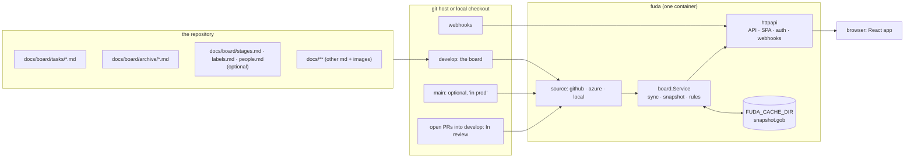
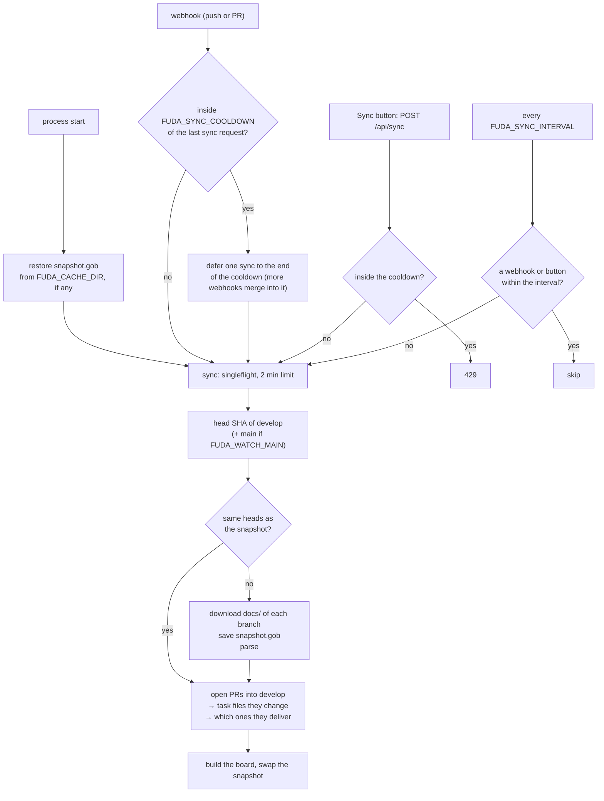
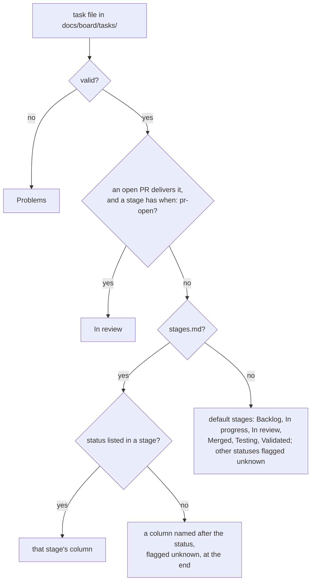

# Architecture

How fuda works today. Everything here is true of the code on `main`; anything decided but not
built is in [decisions.md § TBD](decisions.md#tbd). Change this file in the same PR as the code
it describes.

For how a repo is set up and how teams use the board, see the Guide pages in
[`api/internal/guide/pages`](../api/internal/guide/pages) (also served inside the app).

## The shape

One Go binary serves the JSON API and the embedded React app. One container runs per repository.
There is no database: the repository's markdown files are the data, and fuda keeps a parsed
snapshot of them in memory, plus a copy on disk so a restart has something to show.

## Packages

Dependencies point one way: `cmd/fuda → httpapi → board → (taskfiles, markdown)`, and
`cmd/fuda → source/* → board` (sources satisfy interfaces `board` declares). Interfaces are
declared where they are used.

| Package | Owns |
|---|---|
| `cmd/fuda` | Reads config, picks the source, wires the service and the HTTP server, graceful shutdown. |
| `internal/config` | `FUDA_*` environment variables into one typed `Config`, validated per source. |
| `internal/board` | All behaviour. `service.go`: the read side (board, task, search, archive, doc, asset). `sync.go`: when and how the snapshot is rebuilt. `cache.go`: the disk copy. `reviews.go`: open PRs → In review. The rules: `columns.go`, `facets.go`, `people.go`, `references.go`, `rules.go`, `board.go`. Declares `Source` and the optional `ReviewSource`. |
| `internal/taskfiles` | Parses what fuda reads from a repo: task files (frontmatter + body) and the optional `stages.md`, `labels.md`, `people.md`. Invalid files become Problems, never errors. |
| `internal/source/local` | A checkout on disk: the working tree for develop (uncommitted edits included), `git archive` for other branches. No PRs. |
| `internal/source/github` | GitHub REST: branch head, zipball, open pulls and their files, file contents at a commit. |
| `internal/source/azure` | Azure DevOps REST 7.1: refs, items zip of `/docs`, active PRs, latest iteration changes, item at a commit. PAT (Basic) or a bearer token for local runs. |
| `internal/markdown` | goldmark + GFM. Rewrites links and images: task files → the task sheet, docs → the reader, images → `/api/files`, other repo paths → the git host's web UI, missing targets → plain text. Raw HTML stays escaped. |
| `internal/httpapi` | Routes, JSON, basic auth, webhook verification, request logging, panic recovery, the SPA handler. Thin: parse, call `board`, write. |
| `internal/web` | `go:embed` of the built client (`dist/`). |
| `internal/guide` | `go:embed` of the Guide pages, rendered with `markdown`. |

`client/` is the Vite app. It builds into `api/internal/web/dist`, so `go build` embeds it.
`go build` works without it; the SPA handler then answers "client not built".

## The snapshot

`board.Service` holds an `atomic.Pointer` to an immutable snapshot. Reads never lock; a sync
builds a new snapshot and swaps it in. A snapshot contains:

- the parsed develop result (tasks, archive, config, problems) and, when watched, main;
- the built `Board` (columns, cards, facets, problems), computed once per sync;
- docs (`*.md`) and images under `docs/`, kept as bytes (images up to 5 MB each);
- the open-PR result (In review, tasks that only exist in a PR);
- the head SHA per branch it was built from.

Task bodies and docs are rendered to HTML per request; the board itself is pre-built.

## Sync

- **Failures keep the last snapshot.** A failed head or file read changes nothing and is reported
  as `sync.lastError` in `/api/board`. If only the PR list fails, the new files are used without
  In review, and the error is reported.
- **After a restart** the cached copy is served immediately, marked with its original sync time,
  while the first sync runs. Without a cache, `/api/board` answers 503 until a sync succeeds.
- **Webhook payloads are never trusted.** A webhook only means "read again now".

## How a card gets its column

- **Delivers:** the PR's version of the task file sets `status` to `merged`, or adds the PR's
  number to `pr`, compared with develop. Branch names are never used.
- **A task that exists only in a PR** shows in In review, marked "new in PR".
- **Statuses compare** case-insensitively with whitespace collapsed.
- **main** never moves a card. When watched, a card whose main copy is merged, testing or validated
  gets the "in prod" badge.
- **Archived tasks** (`docs/board/archive/`) are not on the board; `/api/archive` lists them.

### Validation (what becomes a Problem)

- No frontmatter, unclosed frontmatter, invalid YAML, frontmatter that isn't a mapping.
- Missing `id`, `title` or `status`; a field with the wrong shape.
- A filename that doesn't start with the id.
- `status: done` outside the archive.
- A duplicate id (the first file by path wins).
- A task file in a sub-folder of `tasks/` or `archive/`.
- An invalid `stages.md`, `labels.md` or `people.md`: the file is ignored and the board is derived
  from the tasks instead.

### Facets (what the filters offer)

- **People:** from `people.md` (names + aliases) when present; otherwise every owner and tester,
  matched case-insensitively, with a unique first name folded into the full name.
- **Labels:** `group:value`. `theme` reads as `epic`; a bare value goes to the `label` group. From
  `labels.md` when present (only listed values are offered), otherwise from the tasks, with
  default `type` values added.
- **Label colours:** `labels.md` `colors:` first, then fixed colours for the default types, then
  a palette in order per group.
- **Statuses, testers, id prefixes:** from the tasks.

## End to end

The statuses and who changes them are in the Guide's workflow page.

## HTTP API

| Route | Returns |
|---|---|
| `GET /api/board` | Columns, cards, facets, problems, sync state, title, origin. 503 (same body) until a snapshot exists. |
| `GET /api/tasks/{id}` | One card plus custom fields and the rendered body. |
| `GET /api/search?q=` | Ids of tasks whose title or body contains the text. |
| `GET /api/archive` | Archived tasks as cards. |
| `GET /api/docs?path=` | A doc under `docs/`: rendered HTML, title, tasks linking to it. |
| `GET /api/files?path=` | An image under `docs/`, with `nosniff` and a sandboxing CSP. |
| `GET /api/guide`, `GET /api/guide/{slug}` | Guide pages. |
| `POST /api/sync` | 202, or 429 inside the cooldown. |
| `POST /api/webhooks/{github,azure}` | 202. 401 when `FUDA_WEBHOOK_SECRET` is set and GitHub's HMAC signature or Azure's `X-Fuda-Secret` header doesn't match. |
| `GET /healthz` | 200. |
| anything else | The SPA. Hashed files under `/assets/` are cached for a year; `index.html` is `no-cache`. |

With `FUDA_AUTH_PASSWORD` set, every route asks for basic auth except `/healthz` and
`/api/webhooks/*`.

## Client

React 19, TypeScript, Vite, TanStack Router (file routes, typed search params) and TanStack
Query, Tailwind 4 with shadcn components, mermaid loaded lazily.

- **Routes:** `/` board (or list view), `/insights`, `/archive`, `/docs/$`, `/guide/$`.
- **State lives in the URL:** every filter, the sort, the view, the open task (`?task=`) and the
  Insights range, so a link reproduces the view.
- **Filtering, sorting and Insights run in the browser** over `/api/board`. Only "also in task
  text" calls `/api/search`.
- **Components** are split into `atoms`, `molecules`, `organisms`; `components/ui` is generated
  by shadcn and not edited by hand.
- **Light and dark themes** come from CSS tokens in `index.css`.

## Configuration

Every setting is an environment variable; the list with defaults is in the Guide's self-host page
and in [`.env.example`](../.env.example). Fixed in code: the board branch `develop`, the prod
branch `main`, the board folder `docs/board/`, the docs root `docs/`.

## Deployment

The `Dockerfile` builds the client (Node), then a static Go binary, into a distroless image that
runs as non-root with a `/data` volume for the cache. One container per repository; each gets its
own environment.
